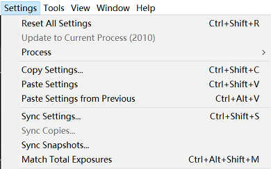

# Progressive Joint Low-light Enhancement and Noise Removal for Raw Images


If you find it useful in your research, please consider citing the following paper:

> ```latex
> @ARTICLE{9730802,
>     author={Lu, Yucheng and Jung, Seung-Won},
>     journal={IEEE Transactions on Image Processing}, 
>     title={Progressive Joint Low-Light Enhancement and Noise Removal for Raw Images}, 
>     year={2022},
>     volume={31},
>     number={},
>     pages={2390-2404},
>     doi={10.1109/TIP.2022.3155948}}
> ```


### Introduction

The main contributions of this work are as follows:

- We present a framework that performs joint enhancement and denoising of low-light images. The proposed framework results in images with higher quality compared to current state-of-the art methods both qualitatively and quantitatively.

- We design a two-branch structure that estimates enhancement parameters in low-resolution via bilateral learning and applies joint enhancement and denoising in full-resolution progressively. This design enables the former to have a large receptive field insensitive to noise while preserving high-resolution features for the latter.

- We propose a strategy that uses several existing datasets developed for enhancement and denoising, respectively. For the coefficient estimation branch, a carefully designed cost function combined with zero-reference loss and high-level perceptual color loss enables weakly supervised network learning. For the joint operation branch, a more accurate noise model estimated using only a few dark image samples is employed in data synthesis.

  

### System Requirements

- Jupyter Notebook Environment

- pyTorch (tested in v1.6)

- torchvision, torchnet, and Visdom
- rawPy (check [this](https://pypi.org/project/rawpy/) for installation instruction)

- py3exiv2 (check [this](https://stackoverflow.com/questions/41075975/impossible-to-install-py3exiv2-with-pip) for installation instruction)
- colour and colour_demosaicing


### Evaluation

1. Clone this repository to your local machine, make sure that the model weights are in the folder *"saves"*.

2. Run the test by loading *"run-demo.ipynb"* in Jupyter Notebook, you may need to specify a new GPU ID if needed:

   ```python
   os.environ["CUDA_VISIBLE_DEVICES"] = '0'
   ```

   A sample image has been included in the folder *"samples"*. The processed image can be found in the folder *"results"*.

   You can also test your own raw files (in Adobe DNG format), it is recommended to use the same configuration specified in Section IV when capturing photos. Path to your data should be added accordingly:

   ```python
   data_root = '/samples/cameraModel/dng'	# data path
   save_root = './results'	# result path
   ```

   *This repository provides noise models of 4 devices as referred to the original paper. You need to run the noise model estimation script for other camera models not in the list (see next section).


### Training from scratch

#### *Data preparation*

*Make sure that all the generated datasets are stored in the same root directory, at each of the following steps, modify the following path in the corresponding file:

```python
data_root = '/home/lab/Documents/ssd/PlieCNR/datasetName'
```

You might also need to change the root directory in *"config.ipynb"*:

```python
data_root = '../../SSD/PlieCNR'
```

- [Adobe FiveK](https://data.csail.mit.edu/graphics/fivek/): in order to train the aesthetic network, this dataset must be modified to remove the effect of exposure and white balancing difference.

  In Lightroom (v3.x only), make sure that the *"Exposure"* and *"Brightness"* tags under *"Develop"* module are set to zero for both the original and the retouched images:

  

  The settings of white balance is a bit more complicated: select all images under the preferred expert's tag, then click *"Settings"*→*"Copy Settings"*; after that navigate to the original images and apply the copied settings by clicking *"Sync Settings"*, this will take a while to complete:

  

  Finally, export both the original and the retouched pairs as 16bit sRGB images to your dataset folder. You need to run *"/datasets/processFivek.ipynb"* to generate a smaller dataset to accelerate training.

- [HDR+](https://hdrplusdata.org/): use all 3,640 bursts (not original images) and run *"/datasets/processHDR+.ipynb"* to generate a dedicated dataset for training the coefficient estimation branch.

- [RAISE](http://loki.disi.unitn.it/RAISE/): use images with the attribute *"outdoor"*, this dataset is used to synthesize noisy-clean image pairs.


#### *Noise Model Estimation*

For more information regarding the details of noise model estimation protocol, please refer to the following work:

> ```latex
> @inproceedings{wei2020physics,
> title={A physics-based noise formation model for extreme low-light raw denoising},
> author={Wei, Kaixuan and Fu, Ying and Yang, Jiaolong and Huang, Hua},
> booktitle={Proceedings of the IEEE/CVF Conference on Computer Vision and Pattern Recognition},
> pages={2758--2767},
> year={2020}
> }
> ```
> Please note that the code in this repository is not the official implementation of the above work. You are welcome to report any issue if something does not seem correct.


<u>IMPORTANT: the training of the coefficient estimation branch should be completed in advance before generating noisy-clean image pairs.</u>

1. For every new camera model, you need to prepare some dark images taken in lightless environment. It is recommended to take several images per ISO setting to build up a better noise model.

2. Run *"/dataset/estNoiseModel.ipynb"* to estimate noise model for the given camera, this will take a while to finish.

3. Run *"/dataset/genSythSet.ipynb"* to generate synthetic noisy-clean image pairs, the obtained volume is about 100GB.


#### *Pre-training Networks*

Run *"train-pretrain.ipynb"* to pre-train both the coefficient estimation branch as well as the aesthetic network.

During pre-training, a window named *"paired"* monitoring the training status is added to the visdom server at port 8686.


#### *Training Coefficient Estimation Branch*

After the pre-training is completed, run *"train-enhancer.ipynb"* to train the coefficient estimation branch.

During training, a window named *"unpaired"* monitoring the training status is added to the visdom server at port 8686.


#### *Training Joint Operation Branch*

For each camera model, specify its model name in *"train-denoiser.ipynb"*:

```python
cam_model = 'Pixel3'
```

Then run the code to train the joint operation branch.

During training, a window named *"denoise"* monitoring the training status is added to the visdom server at port 8686.


### Raw to sRGB Explain

As the proposed framework generates sRGB image from camera raw data, color space conversion from camera raw to sRGB is required. The simplified pipeline can be described as:

**camera raw → CIE XYZ (with D50 white point) → linear sRGB (with D65 white point)**

While the transformation matrix between CIE XYZ and linear sRGB is fixed, the one associated between camera raw and CIE XYZ depends on the camera model and the selected white point, which is interpolated using camera estimated white point and other calibration meta-data coming with the file. A file named *"ISPColor.ipynb"* is provided to cope with all the aforementioned steps, please note that no special treatment is applied to saturated pixels at this moment, so these regions in the results might be incorrect. More details regarding the entire processing procedure can be found in the chapter *"Mapping Camera Color Space to CIE XYZ Space"* from [Adobe DNG specification](https://helpx.adobe.com/content/dam/help/en/photoshop/pdf/dng_spec_1_6_0_0.pdf).
